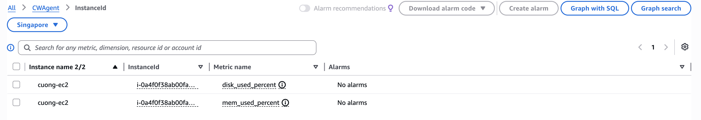
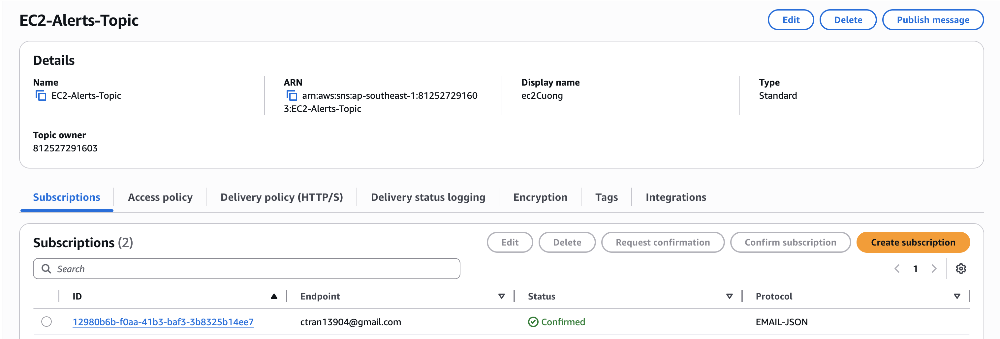
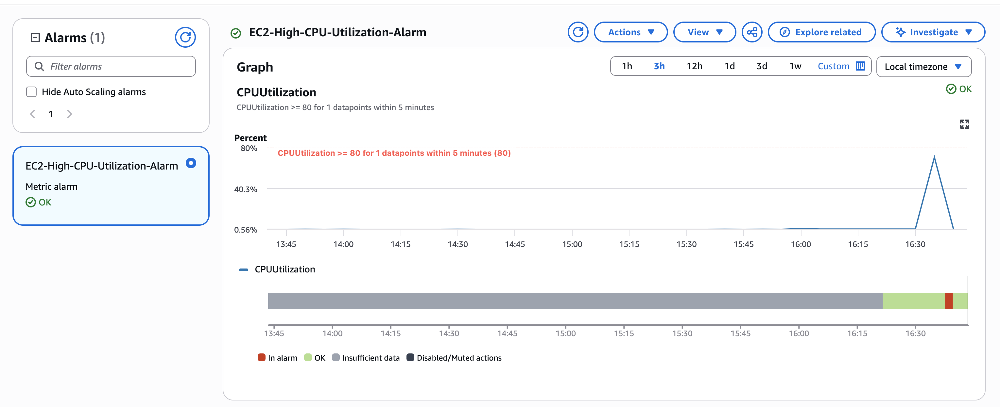
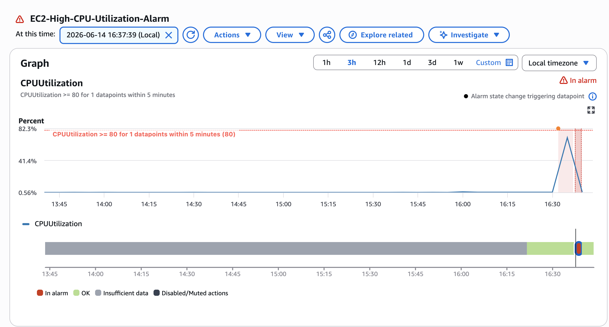
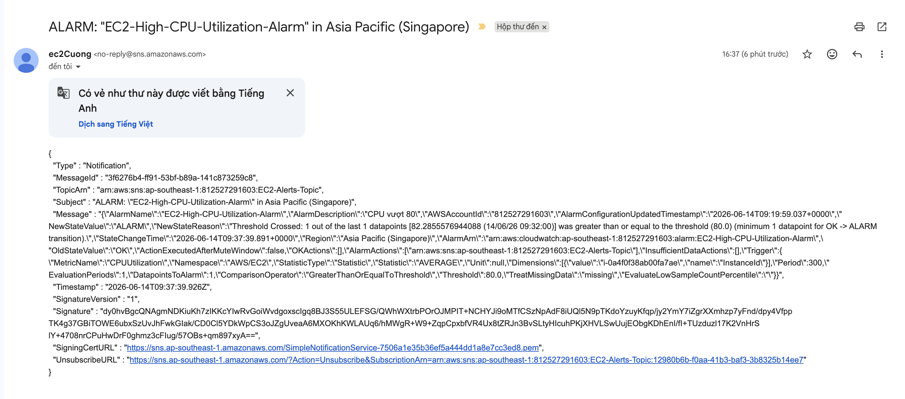
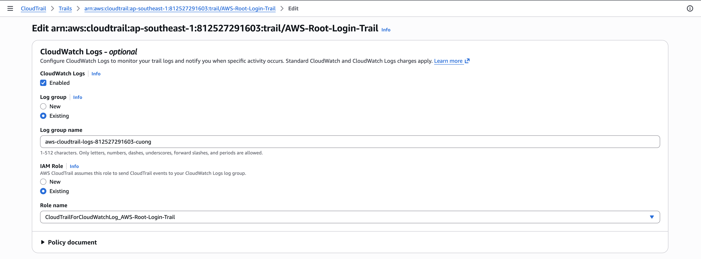
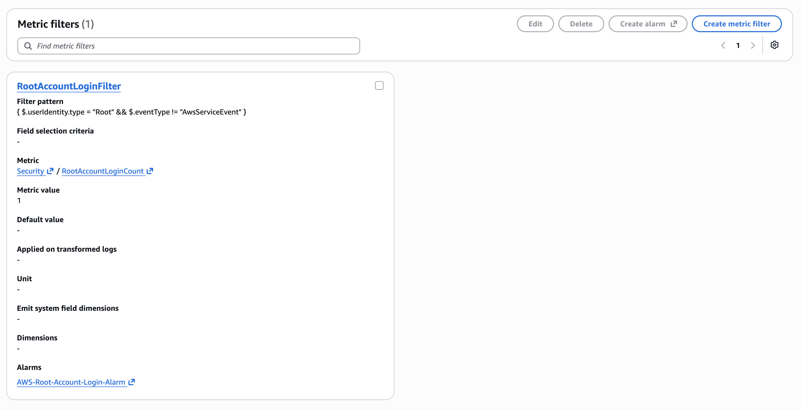
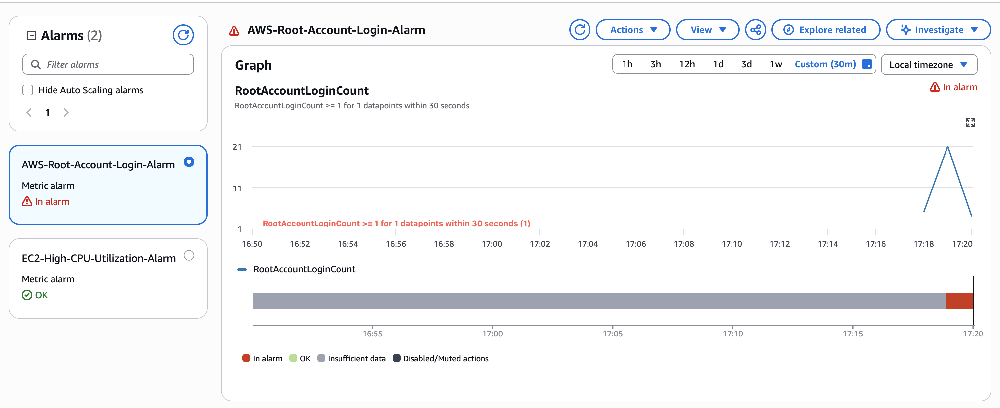
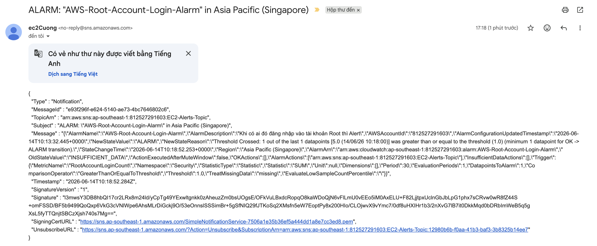

# Báo Cáo Minh Chứng Hoàn Thành Bài Tập

---

## 1. Thông Tin Chung

- **Họ và tên:** Trần Mạnh Cường
- **Tên lớp / Session:** CDO Monitoring (Session 01, 02 & 03)
- **ID của Instance EC2 đã sử dụng:** `i-0a4f0f38ab00fa7ae`
- **Địa chỉ IP Public của EC2:** `54.254.156.2`

---

## 2. Minh Chứng Bài Tập 1: Cài Đặt CloudWatch Agent trên EC2

### 2.1. Kết quả kiểm tra trạng thái dịch vụ trên máy chủ EC2

```bash
sudo /opt/aws/amazon-cloudwatch-agent/bin/amazon-cloudwatch-agent-ctl -m ec2 -a status
```

```json
{
  "status": "running",
  "starttime": "2026-06-12T04:44:35+00:00",
  "configstatus": "configured",
  "version": "1.300066.2"
}
```

### 2.2. Kiểm tra log của CloudWatch Agent (Tùy chọn)

```bash
tail -n 20 /opt/aws/amazon-cloudwatch-agent/logs/amazon-cloudwatch-agent.log
```

### 2.3. Ảnh chụp màn hình Namespace `CWAgent` trên CloudWatch Console



---

## 3. Minh Chứng Bài Tập 2: Cấu Hình CPU Alarm và Gửi Mail Alert via SNS

### 3.1. Ảnh chụp màn hình Subscription đã được xác nhận (Confirmed) trong SNS Console



### 3.2. Ảnh chụp màn hình Cấu hình CloudWatch Alarm



### 3.3. Ảnh chụp màn hình đồ thị Alarm chuyển sang trạng thái "In Alarm"



### 3.4. Ảnh chụp màn hình Email Cảnh Báo từ AWS SNS



---

## 4. Minh Chứng Bài Tập 3: Cấu Hình Cảnh Báo Đăng Nhập Root Account

### 4.1. Ảnh chụp màn hình Cấu hình CloudTrail ghi log về CloudWatch Logs



### 4.2. Ảnh chụp màn hình CloudWatch Metric Filter cho sự kiện Root Login



### 4.3. Ảnh chụp màn hình Cấu hình CloudWatch Alarm cho Root Account Login



### 4.4. Ảnh chụp màn hình Email Cảnh Báo từ AWS SNS khi Root Account đăng nhập


